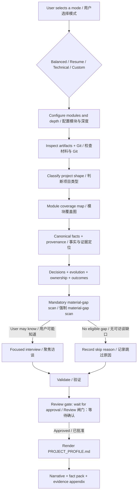

# project-profile

[](https://github.com/lwyp41/project-profile/actions/workflows/validate.yml)
[](https://github.com/lwyp41/project-profile/releases)
[](LICENSE)

**Turn scattered project artifacts into a trustworthy project story.**

`project-profile` is a reusable Agent Skill for reconstructing completed, abandoned, or poorly documented projects from the evidence that still exists: source code, docs, prompts, notebooks, examples, generated artifacts, Git history, and the project owner's memory.

It produces a reviewable `PROJECT_PROFILE.md` for portfolio work, interview preparation, project handoff, retrospectives, technical summaries, and downstream resume workflows.

> **v2 reconstructs facts first, then writes the story.**

Before discovery, it requires an explicit startup choice: Balanced, Resume, Technical, or Custom. Custom is a first-class mode for choosing module emphasis and investigation depth. It also supports 15 knowledge modules, claim-level provenance, focused interviews, native-language output, and synthetic regression evals.

**把散落在代码、文档和记忆里的项目，还原成一份可信、完整、可复用的项目档案。**

`project-profile` 是一个可复用的 Agent Skill，用来从仍然存在的证据中重建已完成、暂停、废弃或文档不完整的项目：代码、文档、Prompt、Notebook、示例、生成物、Git 历史，以及项目所有者还能确认的事实。

它最终生成一份可复核的 `PROJECT_PROFILE.md`，可用于作品集、面试准备、项目交接、项目复盘、Technical Summary，也可以作为后续 Resume Skill 的上游事实层。

> **v2 先重建事实，再写项目故事。**

开始调查前必须明确选择 Balanced、Resume、Technical 或 Custom；Custom 可以一等地指定模块重点和调查深度。除此之外，它支持 15 个知识模块、可配置调查深度、逐条证据定位、聚焦访谈、原生语言输出，以及 synthetic regression eval。

---

## What it does / 它能做什么

### English

- **Reconstruct the project:** recover what the project was for, who it served, how it worked, how it evolved, and what is still unknown.
- **Recover key decisions:** connect constraints, alternatives, choices, rationale, consequences, and later revisions instead of listing files mechanically.
- **Clarify ownership:** separate repository evidence, user testimony, collaboration, and inference rather than guessing authorship from Git location.
- **Handle outcomes carefully:** record usage, scale, quality, efficiency, or business outcomes only when the evidence supports them.
- **Ask useful questions:** investigate first, then ask about material gaps that cannot be recovered from artifacts.
- **Produce reusable facts:** create a neutral downstream fact pack that later Resume, Portfolio, Interview Prep, or Technical Writing workflows can reuse without re-reading the whole repository.
- **Adapt to project shape:** work with software, AI agents, Agent Skills, prompt systems, libraries, data projects, research projects, documentation projects, and sparse artifacts.

### 中文

- **还原项目本身：** 恢复项目为什么存在、给谁用、怎么工作、如何演进，以及哪些内容已经无法确定。
- **挖出关键决策：** 不只列文件，而是恢复约束、备选方案、最终选择、理由、后果和后续变化。
- **恢复 Ownership 边界：** 把仓库证据、用户证词、AI 协作和推断分开，不会因为代码在某个仓库里就直接推断是谁做的。
- **谨慎处理结果和指标：** 使用量、规模、效率、质量或业务结果只有在证据足够时才会被写成结果。
- **只问值得问的问题：** 先查材料，再追问那些无法从项目中恢复、但会影响项目解释的问题。
- **给下游 Skill 提供可复用事实：** 让后续 Resume、Portfolio、Interview Prep 或 Technical Writing 工作流无需重新从头分析仓库。
- **适配不同项目形态：** 软件、AI Agent、Agent Skill、Prompt System、Library、Data、Research、Documentation 和 Sparse Artifact 都可以处理。

---

## What makes it different / 它和普通“项目总结”有什么不同

### English

Project documentation often fails in one of two ways:

1. it becomes a shallow repository summary; or
2. it becomes a polished story that quietly invents rationale, ownership, or impact.

`project-profile` treats project reconstruction as an evidence problem:

- investigate before writing;
- keep provenance and evidence state for material claims;
- keep design intent, mechanisms, observations, and measured outcomes distinct;
- turn answerable gaps into interview questions before `UNKNOWN`;
- do not upgrade unsupported mechanisms into impact;
- keep the narrative readable while preserving an auditable appendix.

The goal is not to score a project or turn it into marketing copy. The goal is to reconstruct what can actually be established.

### 中文

项目总结通常容易走向两个极端：

1. 只把 README 和目录重新概括一遍；
2. 为了写得好看，悄悄补上没有证据的“为什么”“是谁做的”和“结果”。

`project-profile` 把项目重建当成一个证据问题：

- 先调查，再写正文；
- 重要主张保留来源与状态；
- 设计意图、实现机制、用户观察和量化结果分开处理；
- 重要但可由用户回答的缺口，会先进入访谈，而不是直接变成 `UNKNOWN`；
- 机制存在不等于已经产生 Impact；
- 正文负责可读性，附录负责可审计性。

它的目标不是给项目打分，也不是自动把项目包装成营销文案，而是尽可能准确地恢复“这个项目到底是什么”。

---

## Quick start / 快速开始

### English

Choose a profile mode before the Skill inspects the project. If you do not specify one, the Skill must ask; it does not silently default.

Balanced:

```text
Use project-profile in Balanced mode to analyze this project.
```

Career-oriented:

```text
Use project-profile with the resume preset.
Reconstruct the project facts I would need for a strong project section, but do not write resume bullets.
```

Technical:

```text
Use project-profile with the technical preset.
Focus on architecture, AI/agent design, data boundaries, validation, trade-offs, and failure modes.
```

Custom:

```text
Use project-profile in Custom mode.
Investigate decisions and ownership deeply, keep technical architecture standard, and disable outcomes-metrics.
```

Old or incomplete project:

```text
This is an old project with incomplete documentation.
Use project-profile in Balanced mode to recover what it was for, how it evolved, and what can still be verified.
```

After the mode is selected, the Skill investigates the project and runs a material-gap scan. It asks focused interview questions for material gaps you may be able to answer, or records why no interview was needed. Review is a hard user-visible gate: final rendering waits for your approval unless you explicitly requested an unattended/no-review run in advance.

### 中文

开始调查前必须选择一种模式；如果没有指定，Skill 会先询问，不会自动默认为 Balanced。

Balanced：

```text
请使用 project-profile 的 Balanced 模式分析这个项目。
```

偏简历与职业证据：

```text
请使用 project-profile 的 resume preset。
帮我恢复后续简历需要的项目事实，但不要直接写简历 bullet。
```

偏技术：

```text
请使用 project-profile 的 technical preset。
重点恢复架构、AI/Agent 设计、信息边界、验证、Trade-off 和失败模式。
```

旧项目或资料不完整：

```text
这是一个以前留下的不完整项目。
请帮我还原它原本解决什么问题、如何演进，以及现在还能确认哪些事实。
```

Skill 会先调查并执行 material-gap scan：对重要且你可能知道的缺口进行聚焦访谈；如果没有这类缺口，会明确记录跳过原因。最终 Render 前有一个必须经过用户确认的 Review 闸门，除非你事先明确要求 unattended/no-review 运行。

---

## A small example / 一个小例子

### English

Suppose an old Agent Skill repository contains:

- a `SKILL.md`;
- several references;
- a few validators;
- Git history showing workflow changes;
- no usage analytics;
- no written retrospective.

You ask:

```text
Use project-profile with the resume preset.
Recover why this Skill exists, the major workflow decisions, how it evolved, what I owned, and which outcomes are actually supported.
```

Project Profile may recover:

- the current workflow and controls;
- a multi-stage evolution from Git history;
- visible design choices whose rationale is missing;
- validation mechanisms with no measured quality outcome;
- ownership or adoption facts that require user clarification.

It may then ask:

```text
1. What problem made you split the original workflow into separate stages?
2. Which decisions were primarily yours versus AI-assisted implementation?
3. Was this workflow actually used, and is there any defensible scale or outcome to record?
```

The final profile preserves user-confirmed facts as testimony while keeping unsupported impact unresolved.

### 中文

假设一个旧 Agent Skill 仓库里只有：

- `SKILL.md`；
- 一些 references；
- 几个验证脚本；
- 能看到多次流程变化的 Git 历史；
- 没有使用统计；
- 没有专门写过设计复盘。

你可以说：

```text
请使用 project-profile 的 resume preset。
帮我恢复这个 Skill 为什么存在、经历过哪些关键工作流变化、我做了什么、哪些结果有真实证据。
```

Skill 可能从仓库中恢复：

- 当前工作流和控制机制；
- Git 历史中的多阶段演进；
- 某些明显存在、但原因没有写下来的设计选择；
- 已经实现但没有结果测量的 Validation Mechanism；
- 需要用户补充的 Ownership 或 Adoption 信息。

随后它可能问：

```text
1. 当时是什么问题让你把原来的单一工作流拆成多个阶段？
2. 哪些设计决策主要由你决定，哪些实现过程有 AI 协作？
3. 这个工作流是否实际使用过？有没有能够明确限定范围的规模或结果？
```

最终档案会保留用户明确确认的事实，同时没有证据的 Impact 仍然保持未知。

> [!NOTE]
> The example above is fictional. The public regression evals also use synthetic fixtures only.
> 上面的示例是虚构的；仓库里的公开 regression eval 也只使用 synthetic fixture。

---

## How it works / 它如何工作



### English

The important design rule is:

> **Depth changes investigation behavior, not just output length.**

A `deep` module should inspect more sources, recover more history, compare alternatives, resolve conflicts, and ask better questions. It should not simply produce a longer paragraph.

### 中文

最重要的一条规则是：

> **调查深度控制的是“查多少、查多深”，而不是简单控制“写多长”。**

`deep` 应该意味着检查更多来源、历史版本、替代方案、冲突和用户可回答缺口，而不是只把同一段话写得更长。

---

## What you get / 最终会得到什么

> **Project Profile is the factual layer; downstream Skills decide how to present it.**
> **Project Profile 负责把事实恢复完整，后续 Skill 再决定怎么写成简历、作品集或技术总结。**

### English

The main deliverable is `PROJECT_PROFILE.md`. It has three layers:

1. **Project narrative** — a readable reconstruction of why the project existed, how it worked, important decisions, evolution, outcomes, and limitations.
2. **Reusable downstream fact pack** — structured context that Resume, Portfolio, Interview Prep, or Technical Writing workflows can reuse without re-investigating the original repository.
3. **Evidence appendix** — module coverage, evidence states, unresolved Unknown / N/A / conflicts, the canonical claim ledger, source locators, ownership and metric boundaries, rationale, caveats, conflicts, and review state.

The downstream fact pack is intentionally **not** a set of ready-made resume bullets.

### 中文

主要交付物是 `PROJECT_PROFILE.md`，包含三层内容：

1. **项目正文** — 用自然语言讲清楚为什么做、怎么工作、关键决策、如何演进、真实结果和限制。
2. **下游事实包** — 给 Resume、Portfolio、Interview Prep 或 Technical Writing 提供可以直接复用的结构化上下文，不必重新从头分析仓库。
3. **证据附录** — 记录模块覆盖、Evidence Status、Unknown / N/A / Conflict、完整 Claim Ledger、Source Locator、Ownership 与 Metric 边界、Rationale、Caveat、Conflict 和 Review State。

下游事实包有意**不直接生成简历 bullet**。

---

## Profile modes and depth / 档案模式与调查深度

### English

| Mode | Best for | Emphasis |
| --- | --- | --- |
| `balanced` | General project understanding | Broad, even reconstruction across applicable modules |
| `resume` | Resume, interview, career evidence | Ownership, Scale, Complexity, Decision, Impact, Iteration |
| `technical` | Engineering or AI system documentation | Architecture, Constraints, AI/Agent Design, Information Boundary, Validation, Risks |
| `custom` | User-defined priorities | Choose which modules to emphasize, reduce, or disable, and at what depth |

Every module can use one of four investigation depths:

| Depth | Meaning |
| --- | --- |
| `off` | Do not independently investigate or render |
| `brief` | Inspect obvious high-signal sources |
| `standard` | Inspect primary artifacts plus relevant docs, examples, and tests |
| `deep` | Investigate history, alternatives, conflicts, outcomes, and user-answerable gaps |

Modes do not change the truth rules. Balanced, Resume, and Technical provide investigation priorities; Custom preserves the user's explicit module/depth choices rather than becoming a Balanced alias.

### 中文

| 模式 | 适合场景 | 重点 |
| --- | --- | --- |
| `balanced` | 通用项目理解 | 对适用模块做均衡调查 |
| `resume` | 简历、面试、职业证据整理 | Ownership、Scale、Complexity、Decision、Impact、Iteration |
| `technical` | 技术总结、系统理解、交接 | Architecture、Constraints、AI/Agent Design、Information Boundary、Validation、Risks |
| `custom` | 用户自定义调查重点 | 自己选择要加强、降低或关闭的模块，以及每个模块的深度 |

每个模块可以设置四档调查深度：

| 深度 | 含义 |
| --- | --- |
| `off` | 不独立调查，也不单独渲染 |
| `brief` | 只查明显高信号来源 |
| `standard` | 查主要实现、文档、示例和测试 |
| `deep` | 进一步调查历史、替代方案、冲突、结果和用户可回答缺口 |

模式不会改变事实标准。Balanced、Resume 和 Technical 提供调查优先级；Custom 会保留用户明确的模块与深度选择，不会被改写成 Balanced。

Example / 示例：

```yaml
purpose: resume
default_depth: standard

modules:
  project-overview: brief
  background-problem: deep
  decisions-tradeoffs: deep
  ownership-contribution: deep
  outcomes-metrics: deep
  evolution-history: deep
  technical-architecture: standard
  risks-limitations: brief
```

See [templates/profile-config.yaml](templates/profile-config.yaml) and [references/module-registry.md](references/module-registry.md).

---

## The 15 knowledge modules / 15 个知识模块

| Module | 中文说明 |
| --- | --- |
| Project Overview | 项目是什么、范围、状态和项目类型 |
| Background & Problem | 触发背景、痛点、风险、机会或未满足需求 |
| Users & Stakeholders | 用户、操作者、协作者、客户或受影响方 |
| Goals & Success | 项目目标，以及当时如何判断成功 |
| Requirements & Constraints | 产品、技术、运营、隐私、兼容性和交付约束 |
| Product Workflow | 输入、动作、状态变化、输出、闸门和退化路径 |
| Technical Architecture | 组件、接口、依赖、部署或运行形态 |
| AI / Agent Design | 模型角色、Prompt、工具、检索、人审、Eval、可靠性和边界 |
| Information & Data | 来源、Schema、存储、转换、隐私和 Source of Truth |
| Decisions & Trade-offs | 约束 → 备选方案 → 选择 → 理由 → 后果 |
| Ownership & Contribution | 谁负责、谁设计、谁实现、谁维护、谁协作 |
| Validation & QA | 测试、评估、发布闸门、人工检查和失败检查 |
| Outcomes & Metrics | 使用、规模、效率、质量、运营或业务结果 |
| Evolution History | 初始状态 → 首版 → 问题 → 重构 / 迁移 → 当前状态 |
| Risks & Limitations | 已知失败、未解决问题、证据边界和残余风险 |

Not every project needs every module. Applicability is decided from evidence rather than forced by a fixed template.
不是所有项目都需要所有模块；适用性由项目证据决定，而不是强行套固定模板。

---

## Evidence model / 证据模型

### English

Every material claim gets an evidence state:

| State | Meaning |
| --- | --- |
| `VERIFIED` | Directly supported by artifacts or explicit user testimony |
| `INFERRED` | Reasoned from evidence, with boundaries preserved |
| `CLARIFICATION_REQUIRED` | Material and worth asking the user |
| `UNKNOWN` | Relevant but not recoverable reliably |
| `NOT_APPLICABLE` | The concept does not apply |
| `CONFLICTING` | Credible sources disagree |

The Canonical Fact Model also distinguishes:

`fact` · `design_intent` · `mechanism` · `observed_outcome` · `measured_outcome`

For example, “the workflow requires a review gate” is a **mechanism**. It is not automatically “the review gate improved quality.” The second statement needs outcome evidence.

### 中文

每个重要主张都会有 Evidence Status：

| 状态 | 含义 |
| --- | --- |
| `VERIFIED` | 有项目材料或用户明确证词直接支持 |
| `INFERRED` | 基于证据推断，并保留推理边界 |
| `CLARIFICATION_REQUIRED` | 很重要、还没解决，而且值得向用户确认 |
| `UNKNOWN` | 与项目相关，但无法可靠恢复 |
| `NOT_APPLICABLE` | 这个概念确实不适用 |
| `CONFLICTING` | 多个可信来源互相矛盾 |

Canonical Fact Model 还会区分：

`fact` · `design_intent` · `mechanism` · `observed_outcome` · `measured_outcome`

例如，“系统要求在生成前经过 Review Gate”是一个**机制**。它不能自动被写成“Review Gate 提升了输出质量”；后者需要独立的结果证据。

---

## Supported project shapes / 支持的项目形态

```text
Software Repository      AI Agent
Agent Skill              Prompt System
Library / Package        Data Project
Research Project         Documentation Project
Sparse Artifact
```

Project Type is an investigation router, not a rigid output template.
Project Type 的作用是帮助 Skill 决定“优先调查什么”，而不是决定“最后必须套什么模板”。

---

## Installation / 安装

### English

Install the whole repository as one Skill folder. `SKILL.md`, `references/`, `templates/`, and `scripts/` are designed to work together.

Skills CLI:

```bash
npx skills add lwyp41/project-profile --skill project-profile
```

Git clone:

```bash
git clone https://github.com/lwyp41/project-profile.git
```

Then place the repository in the skills directory used by your Agent host.

Updating a Git installation:

```bash
git -C /path/to/project-profile pull
```

`project-profile` has no application runtime dependency; the included Python validator is mainly for development and output-contract validation.

### 中文

请把整个仓库作为一个完整 Skill 安装；`SKILL.md`、`references/`、`templates/` 和 `scripts/` 会一起工作。

Skills CLI：

```bash
npx skills add lwyp41/project-profile --skill project-profile
```

Git 克隆：

```bash
git clone https://github.com/lwyp41/project-profile.git
```

然后把仓库放到你所使用 Agent Host 的 skills 目录。

Git 安装的更新方式：

```bash
git -C /path/to/project-profile pull
```

`project-profile` 本身没有应用运行时依赖；仓库中的 Python validator 主要用于开发和验证输出契约。

---

## Privacy and source boundaries / 隐私与来源边界

### English

Project reconstruction can involve private repositories, unpublished work, customer context, career history, or internal artifacts.

Keep sensitive materials in the project being analyzed. Do not copy them into this public Skill repository.

The public repository uses synthetic regression fixtures only.

The Skill should never infer:

- repository location → personal ownership;
- mechanism exists → impact happened;
- README claim → verified adoption;
- implementation completeness → business outcome;
- approximate memory → precise metric.

### 中文

项目重建经常涉及私有仓库、未公开工作、客户信息、职业经历或内部产物。

敏感材料应该留在正在分析的项目里，不要复制进这个公共 Skill 仓库。

本仓库的公开 regression fixture 全部使用 synthetic data。

Skill 不应该因为以下信息而自动推断：

- 仓库位置 → 个人 Ownership；
- 机制存在 → 已经产生 Impact；
- README 宣称有人使用 → 已验证 Adoption；
- 功能实现完整 → 已产生 Business Outcome；
- 用户给出近似回忆 → 精确 Metric。

---

## Validation and regression testing / Validation 与回归测试

### English

Validate a rendered profile:

```bash
python scripts/validate_profile.py examples/example-skill-project-profile.md
```

Run unit tests:

```bash
python -m unittest discover -s tests -p 'test_*.py' -v
```

The public Golden eval uses a fully synthetic Agent Skill fixture. Resume and Technical profiles consume the same frozen evidence so preset differences can be tested without publishing real project data.

GitHub Actions validates unit tests, English and Chinese examples, synthetic Resume and Technical Golden profiles, and profile configuration.

Static checks validate structure and evidence contracts; they do not prove that a real-world claim is true.

### 中文

验证已经生成的 profile：

```bash
python scripts/validate_profile.py examples/example-skill-project-profile.md
```

运行单元测试：

```bash
python -m unittest discover -s tests -p 'test_*.py' -v
```

公开 Golden Eval 使用完全虚构的 Agent Skill fixture；Resume 和 Technical 两个 preset 使用相同的冻结证据，因此可以测试 preset 差异，而不需要公开真实项目资料。

GitHub Actions 会验证单元测试、英文和中文示例、synthetic Resume / Technical Golden profile，以及 profile config。

静态检查只能验证结构和证据契约，不能证明现实世界中的某个 Claim 是真的。

---

## Repository layout / 仓库结构

```text
SKILL.md                         Skill entrypoint / Skill 入口
references/
  module-registry.md             15-module registry / 15 模块注册表
  depth-policy.md                depth behavior / 调查深度
  evidence-policy.md             evidence states / 证据状态
  interview-policy.md            focused interview / 聚焦访谈
  rendering-policy.md            fact model → profile
  modules/                       module-specific guidance / 模块调查指导
  project-types/                 project-shape routing / 项目类型路由
templates/
  PROJECT_PROFILE.md             final profile template / 最终档案模板
  profile-config.yaml            preset / depth config
scripts/
  validate_profile.py            static validator / 静态校验
examples/                        English + 中文输出示例
evals/                           synthetic regression fixtures
tests/                           validator + contract tests
docs/development/                architecture and design specs / 架构与设计文档
CONTRIBUTING.md
CHANGELOG.md
LICENSE
```

---

## Contributing / 参与贡献

### English

Good contributions include stronger project-type guidance, additional fully synthetic fixtures, Agent-host compatibility notes, validator improvements, and evals that catch unsupported claims or missing provenance.

Before opening a PR:

```bash
python -m unittest discover -s tests -p 'test_*.py' -v
python scripts/validate_profile.py examples/example-skill-project-profile.md
python scripts/validate_profile.py examples/example-skill-project-profile.zh-CN.md
```

If a change affects the output contract, update the relevant policy, template, examples, tests, and changelog together.

See [CONTRIBUTING.md](CONTRIBUTING.md) for the full maintenance workflow.

### 中文

适合的贡献包括更强的 Project Type 调查指导、更多完全 synthetic 的 regression fixture、不同 Agent Host 的兼容性说明、Validator 改进，以及能捕捉无依据 Claim 或缺失 provenance 的 eval。

提交 PR 前建议运行：

```bash
python -m unittest discover -s tests -p 'test_*.py' -v
python scripts/validate_profile.py examples/example-skill-project-profile.md
python scripts/validate_profile.py examples/example-skill-project-profile.zh-CN.md
```

如果修改会影响输出契约，请同步更新对应 policy、template、example、test 和 changelog。

完整维护流程见 [CONTRIBUTING.md](CONTRIBUTING.md)。

## License / 许可证

MIT. See / 详见 [LICENSE](LICENSE).
