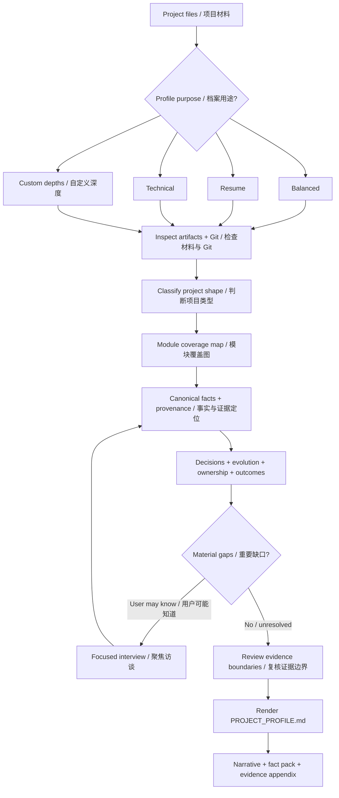

# project-profile

[](https://github.com/lwyp41/project-profile/actions/workflows/validate.yml)
[](https://github.com/lwyp41/project-profile/releases)
[](LICENSE)

**Turn scattered project artifacts into a trustworthy project story.**  
**把散落在代码、文档和记忆里的项目，还原成一份可信、完整、可复用的项目档案。**

`project-profile` is a reusable Agent Skill for reconstructing completed, abandoned, or poorly documented projects from the evidence that still exists: source code, docs, prompts, notebooks, examples, generated artifacts, Git history, and the project owner's memory.  
`project-profile` 是一个可复用的 Agent Skill，用来从仍然存在的证据中重建已完成、暂停、废弃或文档不完整的项目：代码、文档、Prompt、Notebook、示例、生成物、Git 历史，以及项目所有者还能确认的事实。

It produces a reviewable `PROJECT_PROFILE.md` for portfolio work, interview preparation, project handoff, retrospectives, technical summaries, and downstream resume workflows.  
它最终生成一份可复核的 `PROJECT_PROFILE.md`，可用于作品集、面试准备、项目交接、项目复盘、Technical Summary，也可以作为后续 Resume Skill 的上游事实层。

> **v2 reconstructs facts first, then writes the story.**  
> **v2 先重建事实，再写项目故事。**

It supports Resume / Technical / Balanced presets, 15 knowledge modules, configurable investigation depth, claim-level provenance, focused interviews, native-language output, and synthetic regression evals.  
它支持 Resume / Technical / Balanced 预设、15 个知识模块、可配置调查深度、逐条证据定位、聚焦访谈、原生语言输出，以及 synthetic regression eval。

---

## What it does / 它能做什么

- **Reconstruct the project / 还原项目本身** — recover what the project was for, who it served, how it worked, how it evolved, and what is still unknown。恢复项目为什么存在、给谁用、怎么工作、如何演进，以及哪些内容已经无法确定。
- **Recover decisions / 挖出关键决策** — connect constraints, alternatives, choices, rationale, consequences, and later revisions instead of listing files mechanically。不只列文件，而是恢复约束、备选方案、最终选择、理由、后果和后续变化。
- **Clarify ownership / 恢复 Ownership 边界** — separate repository evidence, user testimony, collaboration, and inference rather than guessing authorship from Git location。把仓库证据、用户证词、AI 协作和推断分开，不会因为代码在某个仓库里就直接推断是谁做的。
- **Handle outcomes carefully / 谨慎处理结果和指标** — record usage, scale, quality, efficiency, or business outcomes only when evidence supports them。使用量、规模、效率、质量或业务结果只有在证据足够时才会被写成结果。
- **Ask useful questions / 只问值得问的问题** — investigate first, then ask about material gaps that cannot be recovered from artifacts。先查材料，再追问那些无法从项目中恢复、但会影响项目解释的问题。
- **Produce reusable facts / 给下游 Skill 提供可复用事实** — create a neutral fact pack that later Resume, Portfolio, Interview Prep, or Technical Writing workflows can reuse without re-reading the whole repository。让后续 Resume、Portfolio、Interview Prep 或 Technical Writing 工作流无需重新从头分析仓库。
- **Adapt to project shape / 适配不同项目形态** — software, AI agents, Agent Skills, prompt systems, libraries, data projects, research, documentation, and sparse artifacts 都可以处理。

## What makes it different / 它和普通“项目总结”有什么不同

Project documentation often fails in one of two ways: it becomes a shallow repository summary, or it becomes a polished story that quietly invents rationale, ownership, or impact.  
项目总结通常容易走向两个极端：只把 README 和目录重新概括一遍；或者为了写得好看，悄悄补上没有证据的“为什么”“是谁做的”和“结果”。

`project-profile` treats project reconstruction as an evidence problem:  
`project-profile` 把项目重建当成一个证据问题：

- investigate before writing / **先调查，再写正文**；
- keep provenance and evidence state for material claims / **重要主张保留来源与状态**；
- keep design intent, mechanisms, observations, and measured outcomes distinct / **设计意图、实现机制、用户观察和量化结果分开处理**；
- turn answerable gaps into interview questions before `UNKNOWN` / **重要但可回答的缺口先进入访谈，而不是直接变成 `UNKNOWN`**；
- do not upgrade unsupported mechanisms into impact / **机制存在不等于已经产生 Impact**；
- keep the narrative readable while preserving an auditable appendix / **正文负责可读性，附录负责可审计性**。

The goal is not to score a project or turn it into marketing copy.  
目标不是给项目打分，也不是自动把项目包装成营销文案，而是尽可能准确地恢复“这个项目到底是什么”。

---

## How it works / 它如何工作



> **Depth changes investigation behavior, not just output length.**  
> **调查深度控制的是“查多少、查多深”，而不是简单控制“写多长”。**

A `deep` module should inspect more sources, recover more history, compare alternatives, resolve conflicts, and ask better questions.  
`deep` 应该意味着检查更多来源、历史版本、替代方案、冲突和用户可回答缺口，而不是只把同一段话写得更长。

---

## Quick start / 快速开始

Default / 默认：

```text
Use project-profile to analyze this project.
请使用 project-profile 分析这个项目。
```

Career-oriented / 偏简历与职业证据：

```text
Use project-profile with the resume preset.
Reconstruct the project facts I would need for a strong project section, but do not write resume bullets.

请使用 project-profile 的 resume preset。
帮我恢复后续简历需要的项目事实，但不要直接写简历 bullet。
```

Technical / 偏技术：

```text
Use project-profile with the technical preset.
Focus on architecture, AI/agent design, data boundaries, validation, trade-offs, and failure modes.

请使用 project-profile 的 technical preset。
重点恢复架构、AI/Agent 设计、信息边界、验证、Trade-off 和失败模式。
```

Old or incomplete project / 旧项目或资料不完整：

```text
This is an old project with incomplete documentation.
Recover what it was for, how it evolved, and what can still be verified.

这是一个以前留下的不完整项目。
请帮我还原它原本解决什么问题、如何演进，以及现在还能确认哪些事实。
```

The Skill investigates first. If an important fact cannot be recovered but you may know the answer, it starts a focused interview instead of silently guessing.  
Skill 会先调查；如果某个事实很重要、仓库里找不到、但你可能知道，它会进入聚焦访谈，而不是自己补答案。

---

## Common requests / 常见请求

```text
Turn this repository into a project profile I can reuse for a portfolio.
把这个仓库整理成一份之后可以用于作品集的项目档案。
```

```text
Reconstruct the key decisions and trade-offs. Check Git history for earlier versions.
重点恢复关键决策、为什么这样设计，以及后面有没有发生过重构。
```

```text
Use the resume preset and tell me which career-relevant project facts are still missing.
用 resume preset 分析，并告诉我 Ownership、Scale、Complexity、Decision、Impact、Iteration 哪些还缺证据。
```

```text
Use the technical preset and explain the architecture, data flow, validation, and known limitations.
用 technical preset 帮我解释架构、数据流、验证方式和已知限制。
```

```text
This project is mostly prompts and documents rather than code. Recover the workflow and design rationale.
这个项目主要是 Prompt 和文档，不是传统代码仓库。帮我还原它的工作流和设计逻辑。
```

---

## Presets / 三种预设

| Preset / 预设 | Best for / 适合场景 | Emphasis / 重点 |
| --- | --- | --- |
| `balanced` | General project understanding / 通用项目理解 | Broad, even reconstruction / 对适用模块做均衡调查 |
| `resume` | Resume, interview, career evidence / 简历、面试、职业证据整理 | Ownership, Scale, Complexity, Decision, Impact, Iteration |
| `technical` | Engineering or AI system documentation / 技术总结、系统理解、交接 | Architecture, Constraints, AI/Agent Design, Information Boundary, Validation, Risks |

Presets do not change the truth rules. They change investigation priority and final emphasis.  
预设不会改变事实标准，只会改变调查优先级和最终表达重点。

### Module depth / 四档调查深度

| Depth / 深度 | Meaning / 含义 |
| --- | --- |
| `off` | Do not independently investigate or render / 不独立调查，也不单独渲染 |
| `brief` | Inspect obvious high-signal sources / 只查明显高信号来源 |
| `standard` | Inspect primary artifacts + relevant docs/examples/tests / 查主要实现、文档、示例和测试 |
| `deep` | Investigate history, alternatives, conflicts, outcomes, and answerable gaps / 进一步调查历史、替代方案、冲突、结果和用户可回答缺口 |

Example / 示例：

```yaml
purpose: resume
default_depth: standard

modules:
  project-overview: brief
  background-problem: deep
  decisions-tradeoffs: deep
  ownership-contribution: deep
  outcomes-metrics: deep
  evolution-history: deep
  technical-architecture: standard
  risks-limitations: brief
```

See / 详见 [templates/profile-config.yaml](templates/profile-config.yaml) and [references/module-registry.md](references/module-registry.md).

---

## What it investigates / 它会调查哪些内容

Project Profile v2 uses 15 knowledge modules / Project Profile v2 有 15 个知识模块：

| Module / 模块 | What it reconstructs / 主要恢复内容 |
| --- | --- |
| Project Overview | What the project is, scope, state, project type / 项目是什么、范围、状态和类型 |
| Background & Problem | Trigger, pain point, risk, opportunity / 触发背景、痛点、风险、机会 |
| Users & Stakeholders | Users, operators, collaborators, customers / 用户、操作者、协作者、客户 |
| Goals & Success | Intended outcomes and success criteria / 项目目标与成功判断 |
| Requirements & Constraints | Product, technical, privacy, compatibility, delivery constraints / 产品、技术、隐私、兼容性和交付约束 |
| Product Workflow | Inputs, actions, state transitions, outputs, gates / 输入、动作、状态变化、输出与闸门 |
| Technical Architecture | Components, interfaces, dependencies, runtime shape / 组件、接口、依赖与运行形态 |
| AI / Agent Design | Models, prompts, tools, retrieval, human review, evals, reliability / 模型、Prompt、工具、检索、人审、Eval 与可靠性 |
| Information & Data | Sources, schemas, storage, transformations, privacy / 来源、Schema、存储、转换与隐私 |
| Decisions & Trade-offs | Constraint → alternatives → choice → rationale → consequence / 约束 → 备选方案 → 选择 → 理由 → 后果 |
| Ownership & Contribution | Who owned, designed, implemented, maintained, collaborated / 谁负责、设计、实现、维护与协作 |
| Validation & QA | Tests, evaluation, release gates, manual checks / 测试、评估、发布闸门与人工检查 |
| Outcomes & Metrics | Usage, scale, efficiency, quality, business outcomes / 使用、规模、效率、质量与业务结果 |
| Evolution History | Initial state → first version → pain → redesign → current / 初始状态 → 首版 → 问题 → 重构 → 当前状态 |
| Risks & Limitations | Known failures, unresolved gaps, residual risk / 已知失败、未解决问题与残余风险 |

Not every project needs every module. Applicability is decided from evidence rather than forced by a fixed template.  
不是所有项目都需要所有模块；适用性由项目证据决定，而不是强行套固定模板。

---

## Evidence model / 证据模型

Every material claim gets an evidence state / 每个重要主张都会有 Evidence Status：

| State / 状态 | Meaning / 含义 |
| --- | --- |
| `VERIFIED` | Directly supported by artifacts or explicit user testimony / 有项目材料或用户明确证词直接支持 |
| `INFERRED` | Reasoned from evidence, with boundaries preserved / 基于证据推断，并保留推理边界 |
| `CLARIFICATION_REQUIRED` | Material and worth asking the user / 很重要、还没解决，而且值得向用户确认 |
| `UNKNOWN` | Relevant but not recoverable reliably / 与项目相关，但无法可靠恢复 |
| `NOT_APPLICABLE` | The concept does not apply / 这个概念确实不适用 |
| `CONFLICTING` | Credible sources disagree / 多个可信来源互相矛盾 |

The Canonical Fact Model also distinguishes / Canonical Fact Model 还会区分：

`fact` · `design_intent` · `mechanism` · `observed_outcome` · `measured_outcome`

Why this matters / 为什么重要：

> “The workflow requires a review gate” is a **mechanism**.  
> “系统要求在生成前经过 Review Gate”是一个**机制**。

It is not automatically / 它不能自动变成：

> “The review gate improved quality.”  
> “Review Gate 提升了输出质量。”

The second statement needs outcome evidence. / 后者需要独立的结果证据。

---

## What you get / 最终会得到什么

The main deliverable is `PROJECT_PROFILE.md`. It has three layers.  
主要交付物是 `PROJECT_PROFILE.md`，包含三层内容。

### 1. Project narrative / 项目正文

A readable reconstruction of why the project existed, how it worked, important decisions, evolution, outcomes, and limitations.  
用自然语言讲清楚为什么做、怎么工作、关键决策、如何演进、真实结果和限制。

The body is adaptive: useful modules are rendered, related modules may be merged, and empty template sections are omitted.  
正文是自适应的：只渲染有价值的模块，相关模块可以合并，不会为了模板完整而堆空章节。

### 2. Reusable fact pack / 下游事实包

| Situation / 情境 | Work / decision / 工作与决策 | Artifact / mechanism / 产物与机制 | Observed result / 已观察结果 | Scope / ownership / 范围与归属 | Evidence / 证据 | Caveat / 限制 |
| --- | --- | --- | --- | --- | --- | --- |

This gives later Resume, Portfolio, Interview Prep, or Technical Writing workflows enough structured context to work without re-investigating the original repository.  
后续 Resume、Portfolio、Interview Prep 或 Technical Writing 可以直接复用这些事实，而不必重新从头分析仓库。

It is intentionally **not** a set of ready-made resume bullets.  
它有意**不直接生成简历 bullet**。

### 3. Evidence appendix / 证据附录

The appendix records module coverage, evidence-state counts, unresolved Unknown / N/A / conflicts, the canonical claim ledger, source locators, ownership and metric boundaries, rationale, caveats, conflicts, and review state.  
附录会记录模块覆盖、Evidence Status 统计、Unknown / N/A / Conflict、完整 Claim Ledger、Source Locator、Ownership 与 Metric 边界、Rationale、Caveat、Conflict 和 Review State。

**Narrative for readability; appendix for auditability.**  
**正文负责可读性，附录负责可审计性。**

---

## Example / 示例：reconstructing an old Agent Skill

> [!NOTE]
> This example is fictional. The public regression evals also use synthetic fixtures only.  
> 以下是虚构示例；仓库里的公开 regression eval 也只使用 synthetic fixture。

Suppose an old Skill repository contains `SKILL.md`, several references, a few validators, and Git history showing workflow changes—but no usage analytics or written retrospective.  
假设一个旧 Skill 仓库里只有 `SKILL.md`、一些 references、几个验证脚本，以及能看到多次流程变化的 Git 历史，但没有使用统计，也没有专门写过设计复盘。

You ask / 你可以说：

```text
Use project-profile with the resume preset.
Recover why this Skill exists, the major workflow decisions, how it evolved, what I owned, and which outcomes are actually supported.

请使用 project-profile 的 resume preset。
帮我恢复这个 Skill 为什么存在、经历过哪些关键工作流变化、我做了什么、哪些结果有真实证据。
```

Project Profile may recover / Skill 可能恢复：

- current workflow and controls / 当前工作流和控制机制；
- multi-stage evolution from Git history / Git 历史中的多阶段演进；
- visible design choices whose rationale is missing / 明显存在、但原因没有写下来的设计选择；
- validation mechanisms with no measured quality outcome / 已经实现但没有结果测量的 Validation Mechanism；
- ownership or adoption facts that need user clarification / 需要用户补充的 Ownership 或 Adoption 信息。

It may then ask / 随后它可能问：

```text
1. What problem made you split the original workflow into separate stages?
   当时是什么问题让你把原来的单一工作流拆成多个阶段？

2. Which decisions were primarily yours versus AI-assisted implementation?
   哪些设计决策主要由你决定，哪些实现过程有 AI 协作？

3. Was this workflow actually used, and is there any defensible scale or outcome to record?
   这个工作流是否实际使用过？有没有能够明确限定范围的规模或结果？
```

After interview and review, user-provided facts can be preserved as testimony while unsupported impact remains unresolved.  
访谈和复核完成后，用户补充的信息可以作为 User Testimony 保留，同时没有证据的 Impact 仍然保持未知。

---

## Supported project shapes / 支持的项目形态

```text
Software Repository      AI Agent
Agent Skill              Prompt System
Library / Package        Data Project
Research Project         Documentation Project
Sparse Artifact
```

Project Type is an investigation router, not a rigid output template.  
Project Type 的作用是帮助 Skill 决定“优先调查什么”，而不是决定“最后必须套什么模板”。

---

## Installation / 安装

Install the whole repository as one Skill folder. `SKILL.md`, `references/`, `templates/`, and `scripts/` are designed to work together.  
请把整个仓库作为一个完整 Skill 安装；`SKILL.md`、`references/`、`templates/` 和 `scripts/` 会一起工作。

### Skills CLI

```bash
npx skills add lwyp41/project-profile --skill project-profile
```

### Git clone / Git 克隆

```bash
git clone https://github.com/lwyp41/project-profile.git
```

Then place the repository in the skills directory used by your Agent host.  
然后把仓库放到你所使用 Agent Host 的 skills 目录。

### Updating / 更新

```bash
git -C /path/to/project-profile pull
```

If installed through a Skill manager, use that manager's normal update command.  
如果通过 Skill Manager 安装，则使用对应工具自己的 update 命令。

`project-profile` has no application runtime dependency; the included Python validator is mainly for development and output-contract validation.  
`project-profile` 本身没有应用运行时依赖；仓库中的 Python validator 主要用于开发和验证输出契约。

---

## Privacy and source boundaries / 隐私与来源边界

Project reconstruction can involve private repositories, unpublished work, customer context, career history, or internal artifacts.  
项目重建经常涉及私有仓库、未公开工作、客户信息、职业经历或内部产物。

Keep sensitive materials in the project being analyzed. Do not copy them into this public Skill repository.  
敏感材料应该留在正在分析的项目里，不要复制进这个公共 Skill 仓库。

The public repository uses synthetic regression fixtures only.  
本仓库的公开 regression fixture 全部使用 synthetic data。

The Skill should never infer / Skill 不应该因为以下信息而自动推断：

- repository location → personal ownership / 仓库位置 → 个人 Ownership；
- mechanism exists → impact happened / 机制存在 → 已经产生 Impact；
- README claim → verified adoption / README 宣称有人使用 → 已验证 Adoption；
- implementation completeness → business outcome / 功能实现完整 → 已产生 Business Outcome；
- approximate memory → precise metric / 用户给出近似回忆 → 精确 Metric。

---

## Validation and regression testing / Validation 与回归测试

Validate a rendered profile / 验证已经生成的 profile：

```bash
python scripts/validate_profile.py examples/example-skill-project-profile.md
```

Run unit tests / 运行单元测试：

```bash
python -m unittest discover -s tests -p 'test_*.py' -v
```

The public Golden eval uses a fully synthetic Agent Skill fixture. Resume and Technical profiles consume the same frozen evidence so preset differences can be tested without publishing real project data.  
公开 Golden Eval 使用完全虚构的 Agent Skill fixture；Resume 和 Technical 两个 preset 使用相同的冻结证据，因此可以测试 preset 差异，而不需要公开真实项目资料。

GitHub Actions validates / GitHub Actions 会验证：

- unit tests / 单元测试；
- English and Chinese examples / 英文和中文示例；
- synthetic Resume and Technical Golden profiles；
- profile configuration / profile config。

Static checks validate structure and evidence contracts; they do not prove that a real-world claim is true.  
静态检查只能验证结构和证据契约，不能证明现实世界中的某个 Claim 是真的。

---

## Repository layout / 仓库结构

```text
SKILL.md                         Skill entrypoint / Skill 入口
references/
  module-registry.md             15-module registry / 15 模块注册表
  depth-policy.md                depth behavior / 调查深度
  evidence-policy.md             evidence states / 证据状态
  interview-policy.md            focused interview / 聚焦访谈
  rendering-policy.md            fact model → profile
  modules/                       module-specific guidance / 模块调查指导
  project-types/                 project-shape routing / 项目类型路由
templates/
  PROJECT_PROFILE.md             final profile template / 最终档案模板
  profile-config.yaml            preset / depth config
scripts/
  validate_profile.py            static validator / 静态校验
examples/                        English + 中文输出示例
evals/                           synthetic regression fixtures
tests/                           validator + contract tests
docs/development/                architecture and design specs / 架构与设计文档
CONTRIBUTING.md
CHANGELOG.md
LICENSE
```

---

## Contributing / 参与贡献

Good contributions include stronger project-type guidance, additional fully synthetic fixtures, Agent-host compatibility notes, validator improvements, and evals that catch unsupported claims or missing provenance.  
适合的贡献包括更强的 Project Type 调查指导、更多完全 synthetic 的 regression fixture、不同 Agent Host 的兼容性说明、Validator 改进，以及能捕捉无依据 Claim 或缺失 provenance 的 eval。

Before opening a PR / 提交 PR 前建议运行：

```bash
python -m unittest discover -s tests -p 'test_*.py' -v
python scripts/validate_profile.py examples/example-skill-project-profile.md
python scripts/validate_profile.py examples/example-skill-project-profile.zh-CN.md
```

If a change affects the output contract, update the relevant policy, template, examples, tests, and changelog together.  
如果修改会影响输出契约，请同步更新对应 policy、template、example、test 和 changelog。

See / 完整维护流程见 [CONTRIBUTING.md](CONTRIBUTING.md).

## License / 许可证

MIT. See / 详见 [LICENSE](LICENSE).
