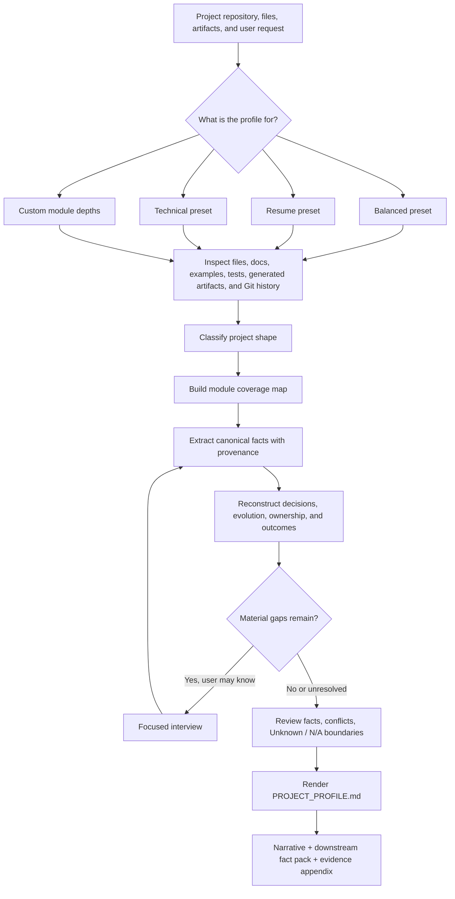
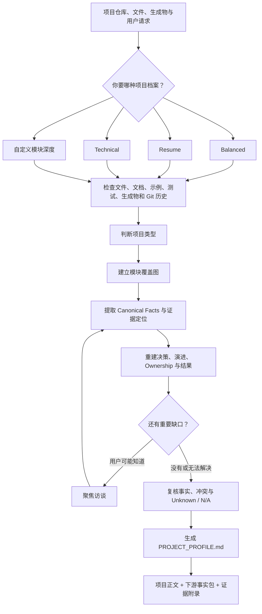

# project-profile

[](https://github.com/lwyp41/project-profile/actions/workflows/validate.yml)
[](https://github.com/lwyp41/project-profile/releases)
[](LICENSE)

**Turn scattered project artifacts into a trustworthy project story.**

`project-profile` is a reusable Agent Skill for reconstructing completed, abandoned, or poorly documented projects from the evidence that still exists: source code, docs, prompts, notebooks, examples, generated artifacts, Git history, and the project owner's memory.

It produces a reviewable `PROJECT_PROFILE.md` that is useful for portfolio work, interview preparation, project handoff, retrospectives, technical summaries, and downstream resume workflows.

Version 2 reconstructs the facts first, then writes the story. It supports configurable investigation depth, Resume / Technical / Balanced presets, claim-level provenance, progressive user interviews, native-language output, and synthetic regression evals.

---

## What it does

- **Reconstructs the project:** recovers what the project was for, who it served, how it worked, how it evolved, and what is still unknown.
- **Finds the important decisions:** connects constraints, alternatives, choices, rationale, consequences, and later revisions instead of listing files mechanically.
- **Recovers ownership and contribution:** separates repository evidence, user testimony, collaboration, and inference rather than guessing authorship from Git location.
- **Checks outcomes carefully:** records usage, scale, quality, efficiency, or business outcomes only when the evidence supports them.
- **Asks only useful questions:** investigates the project first, then asks the user about material gaps that cannot be recovered from artifacts.
- **Produces reusable facts:** creates a neutral downstream fact pack that later portfolio, resume, interview, or technical-writing workflows can reuse without re-reading the entire repository.
- **Adapts to the project:** works with software, AI agents, Agent Skills, prompt systems, libraries, data projects, research projects, documentation projects, and sparse artifacts.

## What makes it different

Project documentation often fails in one of two ways:

1. it becomes a shallow repository summary; or
2. it becomes a polished story that quietly invents rationale, ownership, or impact.

`project-profile` is designed to avoid both.

It treats project reconstruction as an evidence problem:

- the project is investigated before prose is written;
- important claims carry provenance and evidence state;
- design intent, mechanisms, observations, and measured outcomes stay distinct;
- missing but answerable facts become interview questions before they become `UNKNOWN`;
- unsupported impact is not upgraded into a success claim;
- the final narrative stays readable, while the evidence audit remains available in the appendix.

The goal is not to score a project or turn it into marketing copy. The goal is to reconstruct what can actually be established.

---

## How it works



The important design rule is:

> **Depth changes investigation behavior, not just output length.**

A `deep` module should inspect more sources, recover more history, compare alternatives, resolve conflicts, and ask better questions. It should not simply produce a longer paragraph.

---

## Quick start

Point your Agent at a project and ask:

```text
Use project-profile to analyze this project.
```

That is enough for the default `balanced` profile.

For a career-oriented reconstruction:

```text
Use project-profile with the resume preset.
Reconstruct the project facts I would need for a strong project section, but do not write resume bullets.
```

For a technical reconstruction:

```text
Use project-profile with the technical preset.
Focus on architecture, AI/agent design, data boundaries, validation, trade-offs, and failure modes.
```

For an old or incomplete repository:

```text
This is an old project with incomplete documentation.
Use project-profile to recover what it was for, how it evolved, and what can still be verified.
```

The Skill investigates first. If an important fact cannot be recovered but you may know the answer, it starts a focused interview instead of silently guessing.

---

## Common requests

```text
Turn this repository into a project profile I can reuse for a portfolio.
```

```text
Reconstruct the decisions and trade-offs in this project. Git history may contain earlier versions.
```

```text
Use the resume preset and tell me which career-relevant project facts are still missing.
```

```text
Use the technical preset and explain the architecture, data flow, validation, and known limitations.
```

```text
This project is mostly prompts and documents rather than code. Recover the workflow and design rationale.
```

```text
This repository is sparse. Investigate what is recoverable and ask me only the questions that materially change the profile.
```

---

## Investigation presets

| Preset | Best for | Emphasis |
| --- | --- | --- |
| `balanced` | General project understanding | Broad, even reconstruction across applicable modules |
| `resume` | Resume, interview, and career evidence | Ownership, scale, complexity, decisions, impact, iteration |
| `technical` | Engineering or AI system documentation | Architecture, constraints, AI/agent design, information boundaries, validation, risks |

Presets do not change the truth rules. They change what the Skill investigates most deeply and what it emphasizes in the final profile.

### Module depth

Every module can use one of four investigation depths:

| Depth | Meaning |
| --- | --- |
| `off` | Do not independently investigate or render the module |
| `brief` | Inspect obvious high-signal sources and recover only the most important facts |
| `standard` | Inspect primary artifacts plus relevant docs, examples, and tests |
| `deep` | Investigate implementation, history, alternatives, conflicts, older versions, outcomes, and user-answerable gaps |

A project can therefore be broad in some areas and intentionally deep in others.

Example configuration:

```yaml
purpose: resume
default_depth: standard

modules:
  project-overview: brief
  background-problem: deep
  decisions-tradeoffs: deep
  ownership-contribution: deep
  outcomes-metrics: deep
  evolution-history: deep
  technical-architecture: standard
  risks-limitations: brief
```

See [templates/profile-config.yaml](templates/profile-config.yaml) and [references/module-registry.md](references/module-registry.md).

---

## What it investigates

Project Profile v2 uses 15 knowledge modules:

| Module | What it reconstructs |
| --- | --- |
| Project overview | What the project is, its scope, current state, and project type |
| Background & problem | Trigger, pain point, risk, opportunity, or unmet need |
| Users & stakeholders | Intended users, operators, collaborators, customers, or affected groups |
| Goals & success | Intended outcomes and how success was supposed to be recognized |
| Requirements & constraints | Product, technical, operational, privacy, compatibility, and delivery constraints |
| Product workflow | Inputs, actions, state transitions, outputs, gates, and fallback paths |
| Technical architecture | Components, interfaces, dependencies, deployment/runtime shape |
| AI / agent design | Model role, prompts, tools, retrieval, human review, evals, reliability, and boundaries |
| Information & data | Sources, schemas, storage, transformations, privacy, and source-of-truth rules |
| Decisions & trade-offs | Constraint → alternatives → choice → rationale → consequence |
| Ownership & contribution | Who owned, designed, implemented, maintained, reviewed, or collaborated |
| Validation & QA | Tests, evaluation, release gates, manual review, failure checks |
| Outcomes & metrics | Usage, scale, efficiency, quality, operational or business outcomes |
| Evolution history | Initial state → first version → pain → redesign / migration → current state |
| Risks & limitations | Known failures, unresolved gaps, evidence boundaries, and residual risk |

Not every project needs every module. Applicability is decided from the evidence rather than from a fixed template.

---

## Evidence model

Every material claim is assigned an evidence state:

| State | Meaning |
| --- | --- |
| `VERIFIED` | Directly supported by a project artifact or explicit user testimony |
| `INFERRED` | Reasoned from evidence, with the reasoning preserved |
| `CLARIFICATION_REQUIRED` | Material, unresolved, and worth asking the user |
| `UNKNOWN` | Relevant, but cannot be recovered reliably |
| `NOT_APPLICABLE` | The concept does not apply to this project |
| `CONFLICTING` | Credible sources disagree |

The canonical fact model also keeps claims typed as:

- `fact`
- `design_intent`
- `mechanism`
- `observed_outcome`
- `measured_outcome`

That distinction matters. For example:

> “The workflow requires a review gate” is a **mechanism**.

It is not automatically:

> “The review gate improved quality.”

The second statement needs outcome evidence.

---

## What you get

The main deliverable is `PROJECT_PROFILE.md`.

It has three layers:

### 1. Project narrative

A readable reconstruction of the project: why it existed, how it worked, important decisions, evolution, outcomes, and limitations.

The body is adaptive. It renders only the modules that are useful for the current project and can merge related sections when that reads better.

### 2. Reusable downstream fact pack

A neutral interface for later workflows:

| Situation | Work / decision | Artifact / mechanism | Observed result | Scope / ownership | Evidence | Caveat |
| --- | --- | --- | --- | --- | --- | --- |

This gives a later Resume Skill, portfolio writer, interview-prep workflow, or technical writer enough structured context to work without re-investigating the original repository.

It is intentionally **not** a set of ready-made resume bullets.

### 3. Evidence appendix

The appendix records:

- module coverage;
- evidence-state counts;
- unresolved Unknown / N/A / conflicts;
- a canonical claim ledger;
- source locators;
- ownership and metric boundaries;
- rationale, caveats, conflicts, and review state.

This is what keeps a polished narrative connected to the underlying evidence.

---

## Example: reconstructing an old Agent Skill

> [!NOTE]
> This example is fictional. The repository's public regression evals also use synthetic fixtures only.

Suppose an old Skill repository contains:

- a `SKILL.md`;
- several reference files;
- a few validation scripts;
- Git history showing multiple workflow changes;
- no usage analytics;
- no written design retrospective.

You ask:

```text
Use project-profile with the resume preset.
Recover why this Skill exists, the major workflow decisions, how it evolved, what I owned, and which outcomes are actually supported.
```

Project Profile may recover:

- the repository's current workflow and controls from implementation files;
- a multi-stage evolution from Git history;
- one or more visible design choices whose rationale is missing;
- validation mechanisms that exist in code but have no measured quality outcome;
- missing ownership or adoption facts that require user clarification.

It may then ask:

```text
1. What problem made you split the original workflow into separate stages?
2. Which parts were primarily your decisions versus AI-assisted implementation?
3. Was this workflow actually used, and if so, is there any defensible scale or outcome you want recorded?
```

After the interview and review, the final profile can preserve those answers as user testimony while keeping unsupported impact claims unresolved.

---

## Supported project shapes

`project-profile` is not limited to conventional codebases.

```text
Software repository      AI agent
Agent Skill              Prompt system
Library / package        Data project
Research project         Documentation project
Sparse artifact
```

Project type acts as an investigation router, not a rigid output template.

A software repository may emphasize architecture, constraints, integrations, and QA. An Agent Skill may emphasize routing, progressive loading, source boundaries, human gates, evaluation, and failure behavior. A sparse artifact may rely more heavily on provenance checks and focused user interviews.

---

## Installation

Install the whole repository as one Skill folder. `SKILL.md`, `references/`, `templates/`, and `scripts/` are designed to work together.

### Skills CLI

```bash
npx skills add lwyp41/project-profile --skill project-profile
```

### Git clone

```bash
git clone https://github.com/lwyp41/project-profile.git
```

Then place the repository in the skills directory used by your Agent host.

For Codex, use the skills location configured by your installation. For other Agent hosts, use their equivalent personal or project-level skills directory.

### Updating

If installed by Git:

```bash
git -C /path/to/project-profile pull
```

If installed by a Skill manager, use that manager's normal update command.

`project-profile` has no application runtime dependency; the included Python validator is only needed when developing or validating profile artifacts.

---

## Privacy and source boundaries

Project reconstruction can involve private repositories, unpublished work, customer context, career history, or internal artifacts.

Keep sensitive project materials in the project being analyzed. Do not copy them into this public Skill repository.

The public repository uses synthetic regression fixtures. Real-project facts, user testimony, credentials, customer data, private URLs, and generated private artifacts should remain outside the reusable Skill package.

The Skill should never infer:

- ownership from repository location alone;
- impact from the existence of a mechanism;
- user adoption from a README claim;
- business results from implementation completeness;
- metric precision from an approximate memory.

---

## Validation and regression testing

The repository includes a static validator for the rendered profile contract:

```bash
python scripts/validate_profile.py examples/example-skill-project-profile.md
```

Run the unit tests with:

```bash
python -m unittest discover -s tests -p 'test_*.py' -v
```

The public Golden eval uses a fully synthetic Agent Skill fixture. Resume and Technical profiles consume the same frozen evidence so preset differences can be tested without publishing a real user's project data.

GitHub Actions validates:

- unit tests;
- English and Chinese examples;
- synthetic Resume and Technical Golden profiles;
- profile configuration.

Static checks validate structure and evidence contracts. They do not prove that a real-world claim is true; source review and human judgment still matter.

---

## Repository layout

```text
SKILL.md                         Skill entrypoint and orchestration
references/
  module-registry.md             15-module registry and preset mapping
  depth-policy.md                off / brief / standard / deep behavior
  evidence-policy.md             evidence states and provenance rules
  interview-policy.md            focused gap-driven interview behavior
  rendering-policy.md            canonical fact model → final profile
  modules/                       module-specific investigation guidance
  project-types/                 project-shape routing guidance
templates/
  PROJECT_PROFILE.md             final profile template
  profile-config.yaml            preset / depth configuration example
scripts/
  validate_profile.py            static profile contract validator
examples/                        English and Chinese rendered examples
evals/                           synthetic controlled regression fixtures
tests/                           validator and instruction-contract tests
docs/development/                architecture, decisions, and design specs
CONTRIBUTING.md
CHANGELOG.md
LICENSE
```

---

## Contributing

Issues and pull requests are welcome.

Good contributions include:

- stronger project-type investigation guidance;
- additional fully synthetic regression fixtures;
- compatibility notes for Agent hosts;
- validator improvements;
- evals that catch unsupported claims, missing provenance, or preset regressions.

Before opening a PR:

```bash
python -m unittest discover -s tests -p 'test_*.py' -v
python scripts/validate_profile.py examples/example-skill-project-profile.md
python scripts/validate_profile.py examples/example-skill-project-profile.zh-CN.md
```

If a change affects the output contract, update the relevant policy, template, examples, tests, and changelog together.

See [CONTRIBUTING.md](CONTRIBUTING.md) for the full maintenance workflow.

## License

MIT. See [LICENSE](LICENSE).

---

# 中文文档

**把散落在代码、文档和记忆里的项目，还原成一份可信、完整、可复用的项目档案。**

`project-profile` 是一个可复用的 Agent Skill，用来重建已经完成、暂停、废弃，或者文档不完整的项目。它会调查代码、README、设计文档、Prompt、Notebook、示例、生成物、Git 历史，以及项目所有者还能确认的事实，最终生成一份可复核的 `PROJECT_PROFILE.md`。

它适合用于作品集、面试准备、项目复盘、项目交接、Technical Summary，也可以作为后续 Resume Skill 的上游事实层。

v2 的核心变化是：**先重建事实，再写项目故事。** 它支持 Resume / Technical / Balanced 预设、15 个知识模块、四档调查深度、逐条证据状态、聚焦访谈、原生语言输出，以及公开可分享的 synthetic regression eval。

---

## 它能做什么

- **还原项目本身：** 恢复项目为什么存在、给谁用、怎么工作、如何演进，以及哪些内容已经无法确定。
- **挖出真正重要的设计决策：** 不只列文件，而是尝试恢复约束、备选方案、最终选择、理由、结果和后续变化。
- **恢复 Ownership 和贡献边界：** 把仓库证据、用户证词、AI 协作和推断分开，不会因为代码在某个仓库里就直接推断是谁做的。
- **谨慎处理结果和指标：** 使用量、规模、效率、质量或业务结果只有在证据足够时才会被写成结果。
- **只问值得问的问题：** 先查材料，再追问那些无法从项目中恢复、但用户很可能知道，而且会影响项目解释的问题。
- **给下游 Skill 提供可复用事实：** Resume、Portfolio、Interview Prep、Technical Writing 可以直接复用事实包，而不必重新从头读完整仓库。
- **适配不同项目形态：** 软件、AI Agent、Agent Skill、Prompt System、Library、Data、Research、Documentation 和 Sparse Artifact 都可以处理。

## 它和普通“项目总结”有什么不同

项目总结通常容易走向两个极端：

1. 只把 README 和目录重新概括一遍；
2. 为了写得好看，悄悄补上没有证据的“为什么”和“结果”。

`project-profile` 尽量避免这两个问题。

它把项目重建当成一个证据问题：

- 先调查，再写正文；
- 重要主张都有来源和状态；
- 设计意图、实现机制、用户观察、量化结果分开处理；
- 重要但可由用户回答的缺口，会先进入访谈，而不是直接写成 `UNKNOWN`；
- 没有证据的影响不会被包装成成果；
- 正文保持可读，详细证据放在附录。

它的目标不是给项目打分，也不是自动把项目包装成营销文案，而是尽可能准确地恢复“这个项目到底是什么”。

---

## 工作流程



最重要的一条规则是：

> **调查深度控制的是“查多少、查多深”，而不是简单控制“写多长”。**

`deep` 应该意味着检查更多来源、历史版本、替代方案、冲突和用户可回答的缺口，而不是只把同一段话写得更长。

---

## 快速开始

默认分析：

```text
请使用 project-profile 分析这个项目。
```

偏简历 / 职业证据：

```text
请使用 project-profile 的 resume preset。
帮我恢复这个项目中适合后续简历使用的事实，但不要直接写简历 bullet。
```

偏技术：

```text
请使用 project-profile 的 technical preset。
重点恢复架构、AI/Agent 设计、信息边界、验证、Trade-off 和失败模式。
```

旧项目 / 文档不完整：

```text
这是一个以前留下的不完整项目。
请使用 project-profile 帮我还原它原本解决什么问题、如何演进，以及现在还能确认哪些事实。
```

Skill 会先调查。如果发现某个事实非常重要、仓库里找不到、但你可能知道，它会进入聚焦访谈，而不是自己补答案。

---

## 常见请求

```text
把这个仓库整理成一份之后可以用于作品集的项目档案。
```

```text
重点恢复这个项目的关键决策、为什么这样设计，以及后面有没有发生过重构。
```

```text
用 resume preset 分析，并告诉我 Ownership、Scale、Complexity、Decision、Impact、Iteration 哪些还缺证据。
```

```text
用 technical preset 帮我解释架构、数据流、验证方式和已知限制。
```

```text
这个项目主要是 Prompt 和文档，不是传统代码仓库。帮我还原它的工作流和设计逻辑。
```

```text
这个项目资料非常少。先尽量恢复能确认的内容，只问真正会影响项目解释的问题。
```

---

## 三种预设

| 预设 | 适合场景 | 重点 |
| --- | --- | --- |
| `balanced` | 通用项目理解 | 对适用模块做均衡调查 |
| `resume` | 简历、面试、职业证据整理 | Ownership、Scale、Complexity、Decision、Impact、Iteration |
| `technical` | 技术总结、系统理解、交接 | Architecture、Constraints、AI/Agent Design、Information Boundary、Validation、Risks |

预设不会改变事实标准，只会改变调查优先级和最终表达重点。

### 四档调查深度

| 深度 | 含义 |
| --- | --- |
| `off` | 不独立调查，也不单独渲染 |
| `brief` | 只查明显高信号来源，恢复最重要的少量事实 |
| `standard` | 查主要实现、文档、示例和测试 |
| `deep` | 进一步调查历史、旧版本、替代方案、冲突、结果和用户可回答缺口 |

示例配置：

```yaml
purpose: resume
default_depth: standard

modules:
  project-overview: brief
  background-problem: deep
  decisions-tradeoffs: deep
  ownership-contribution: deep
  outcomes-metrics: deep
  evolution-history: deep
  technical-architecture: standard
  risks-limitations: brief
```

详细配置见 [templates/profile-config.yaml](templates/profile-config.yaml) 和 [references/module-registry.md](references/module-registry.md)。

---

## 它会调查哪些内容

Project Profile v2 有 15 个知识模块：

| 模块 | 主要恢复内容 |
| --- | --- |
| Project Overview | 项目是什么、范围、状态和项目类型 |
| Background & Problem | 触发背景、痛点、风险、机会或未满足需求 |
| Users & Stakeholders | 用户、操作者、协作者、客户或受影响方 |
| Goals & Success | 项目目标，以及当时如何判断成功 |
| Requirements & Constraints | 产品、技术、运营、隐私、兼容性和交付约束 |
| Product Workflow | 输入、动作、状态变化、输出、闸门和退化路径 |
| Technical Architecture | 组件、接口、依赖、部署或运行形态 |
| AI / Agent Design | 模型角色、Prompt、工具、检索、人审、Eval、可靠性和边界 |
| Information & Data | 来源、Schema、存储、转换、隐私和 Source of Truth |
| Decisions & Trade-offs | 约束 → 备选方案 → 选择 → 理由 → 后果 |
| Ownership & Contribution | 谁负责、谁设计、谁实现、谁维护、谁协作 |
| Validation & QA | 测试、评估、发布闸门、人工检查和失败检查 |
| Outcomes & Metrics | 使用、规模、效率、质量、运营或业务结果 |
| Evolution History | 初始状态 → 首版 → 问题 → 重构 / 迁移 → 当前状态 |
| Risks & Limitations | 已知失败、未解决问题、证据边界和残余风险 |

不是所有项目都需要所有模块。适用性由项目证据决定，而不是强行套固定模板。

---

## 证据模型

每个重要主张都会有 Evidence Status：

| 状态 | 含义 |
| --- | --- |
| `VERIFIED` | 有项目材料或用户明确证词直接支持 |
| `INFERRED` | 基于证据做出的推断，并保留推理边界 |
| `CLARIFICATION_REQUIRED` | 很重要、还没解决，而且值得向用户确认 |
| `UNKNOWN` | 与项目相关，但无法可靠恢复 |
| `NOT_APPLICABLE` | 这个概念确实不适用于当前项目 |
| `CONFLICTING` | 多个可信来源互相矛盾 |

Canonical Fact Model 还会区分：

- `fact`
- `design_intent`
- `mechanism`
- `observed_outcome`
- `measured_outcome`

这个区分很重要。

例如：

> “系统要求在生成前经过 Review Gate”是 **机制**。

它不能自动被写成：

> “Review Gate 提升了输出质量”。

后者需要独立的结果证据。

---

## 最终会得到什么

主要交付物是 `PROJECT_PROFILE.md`，包含三层内容。

### 1. 项目正文

用自然语言讲清楚：

- 为什么做；
- 怎么工作；
- 关键决策是什么；
- 如何演进；
- 有哪些真实结果；
- 有哪些限制。

正文是自适应的：只渲染有价值的模块，相关模块也可以合并，不会为了模板完整而堆空章节。

### 2. 下游事实包

提供给后续 Skill 使用的中性接口：

| 情境 | 工作 / 决策 | 产物 / 机制 | 已观察结果 | 范围 / Ownership | 证据 | 限制 |
| --- | --- | --- | --- | --- | --- | --- |

Resume Skill、Portfolio Writer、Interview Prep 或 Technical Writer 可以直接复用这些事实，而不必重新从头分析仓库。

这不是现成的简历 bullet。

### 3. 证据附录

附录会记录：

- 模块覆盖情况；
- Evidence Status 统计；
- Unknown / N/A / Conflict；
- 完整 Claim Ledger；
- Source Locator；
- Ownership 与 Metric 边界；
- Rationale、Caveat、Conflict 和 Review State。

正文负责可读性，附录负责可审计性。

---

## 示例：还原一个旧 Agent Skill

> [!NOTE]
> 以下是虚构示例。仓库里的公开 regression eval 也只使用 synthetic fixture。

假设一个旧 Skill 仓库里只有：

- `SKILL.md`；
- 一些 references；
- 几个验证脚本；
- 能看到多次流程变化的 Git 历史；
- 没有使用统计；
- 没有专门写过设计复盘。

你可以说：

```text
请使用 project-profile 的 resume preset。
帮我恢复这个 Skill 为什么存在、经历过哪些关键工作流变化、我做了什么、哪些结果有真实证据。
```

Skill 可能从仓库中恢复：

- 当前工作流和控制机制；
- Git 历史中的多阶段演进；
- 某些明显存在、但原因没有写下来的设计选择；
- 已经实现但没有结果测量的 Validation Mechanism；
- 需要用户补充的 Ownership 或 Adoption 信息。

随后它可能问：

```text
1. 当时是什么问题让你把原来的单一工作流拆成多个阶段？
2. 哪些设计决策主要由你决定，哪些实现过程有 AI 协作？
3. 这个工作流是否实际使用过？如果使用过，有没有你愿意保留、而且能够明确限定范围的规模或结果？
```

访谈和复核完成后，用户补充的信息会作为 User Testimony 保留，同时没有证据的 Impact 仍然保持未知。

---

## 支持的项目形态

```text
Software Repository      AI Agent
Agent Skill              Prompt System
Library / Package        Data Project
Research Project         Documentation Project
Sparse Artifact
```

Project Type 的作用是帮助 Skill 决定“优先调查什么”，而不是决定“最后必须套什么模板”。

---

## 安装

请把整个仓库作为一个完整 Skill 安装。`SKILL.md`、`references/`、`templates/` 和 `scripts/` 会一起工作。

### Skills CLI

```bash
npx skills add lwyp41/project-profile --skill project-profile
```

### Git Clone

```bash
git clone https://github.com/lwyp41/project-profile.git
```

然后把仓库放到你所使用 Agent Host 的 skills 目录。

Codex 使用你当前安装配置对应的 Skills 目录；其他 Agent 使用它们自己的个人级或项目级 Skills 目录。

### 更新

Git 安装：

```bash
git -C /path/to/project-profile pull
```

如果通过 Skill Manager 安装，则使用对应工具自己的 update 命令。

`project-profile` 本身没有应用运行时依赖；仓库中的 Python validator 主要用于开发和验证输出契约。

---

## 隐私与来源边界

项目重建经常涉及私有仓库、未公开工作、客户信息、职业经历或内部产物。

敏感材料应该留在正在分析的项目里，不要复制进这个公共 Skill 仓库。

本仓库的公开 regression fixture 全部使用 synthetic data。真实项目事实、用户证词、凭证、客户数据、私有 URL 和私人生成物都不应该进入公共 Skill Package。

Skill 不应该因为以下信息而自动推断：

- 仓库位置 → 个人 Ownership；
- 机制存在 → 已经产生 Impact；
- README 宣称有人使用 → 已验证 Adoption；
- 功能实现完整 → 已产生 Business Outcome；
- 用户给出近似回忆 → 精确 Metric。

---

## Validation 与回归测试

验证一个已经生成的 profile：

```bash
python scripts/validate_profile.py examples/example-skill-project-profile.md
```

运行单元测试：

```bash
python -m unittest discover -s tests -p 'test_*.py' -v
```

公开 Golden Eval 使用完全虚构的 Agent Skill fixture。Resume 和 Technical 两个 preset 使用完全相同的冻结证据，因此可以测试 preset 差异，而不需要公开任何真实用户项目资料。

GitHub Actions 会验证：

- 单元测试；
- 英文和中文示例；
- synthetic Resume / Technical Golden profile；
- profile config。

静态检查只能验证结构和证据契约，不能证明现实世界中的某个 Claim 是真的。事实真实性仍然需要来源审查和人工判断。

---

## 仓库结构

```text
SKILL.md                         Skill 入口和流程协调
references/
  module-registry.md             15 模块注册表与 preset 映射
  depth-policy.md                off / brief / standard / deep 行为
  evidence-policy.md             Evidence Status 与来源规则
  interview-policy.md            基于缺口的聚焦访谈
  rendering-policy.md            Canonical Fact Model → 最终档案
  modules/                       各模块调查指导
  project-types/                 各项目类型的调查路由
templates/
  PROJECT_PROFILE.md             最终 Profile 模板
  profile-config.yaml            preset / depth 配置示例
scripts/
  validate_profile.py            Profile 静态契约校验
examples/                        英文和中文输出示例
evals/                           synthetic controlled regression fixture
tests/                           validator 与 instruction contract 测试
docs/development/                架构、设计和决策文档
CONTRIBUTING.md
CHANGELOG.md
LICENSE
```

---

## 参与贡献

欢迎提交 Issue 和 Pull Request。

适合的贡献包括：

- 更强的 Project Type 调查指导；
- 更多完全 synthetic 的 regression fixture；
- 不同 Agent Host 的兼容性说明；
- Validator 改进；
- 能捕捉无依据 Claim、缺失 provenance 或 preset 回归的 eval。

提交 PR 前建议运行：

```bash
python -m unittest discover -s tests -p 'test_*.py' -v
python scripts/validate_profile.py examples/example-skill-project-profile.md
python scripts/validate_profile.py examples/example-skill-project-profile.zh-CN.md
```

如果修改会影响输出契约，请同步更新对应 policy、template、example、test 和 changelog。

完整维护流程见 [CONTRIBUTING.md](CONTRIBUTING.md)。

## 许可证

MIT，详见 [LICENSE](LICENSE)。
